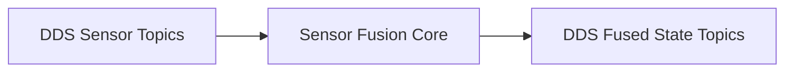

# dds-fusion-core

## Purpose
This repository contains the **embedded real-time brain** of the system.

It performs sensor fusion, state estimation, and health monitoring using DDS as the primary middleware.

## Responsibilities
- DDS publishers/subscribers
- Sensor fusion algorithms
- Time synchronization & QoS enforcement
- System state estimation

## What happens here
1. DDS receives sensor data
2. Fusion algorithms compute system state
3. Fused state is published via DDS
4. Health & status topics are updated

## Architecture


## Notes
- Must remain cloud-agnostic
- Designed to run on embedded Linux
- Determinism and timing are critical


Minimal closed-loop utilities for driving actuator commands over SocketCAN using a CSV CAN map.

## What this repo contains

- `config/can/can_map.csv`  
  CSV-based CAN database (frame + signal definitions). Used for encoding/decoding.

- `closed_loop/`  
  Scenario-based actuator command sender:
  - Loads a JSON scenario (slalom, etc.)
  - Encodes `ACTUATOR_CMD_1` using `can_map.csv`
  - Transmits on SocketCAN (e.g. `vcan0`) at the frame `cycle_ms`

- `utils/`  
  Reusable utilities:
  - CSV CAN map loader
  - bit packing / signal scaling codec
  - file logger (`closed_loop.log`)

Transport uses `go.einride.tech/can` + `socketcan`.

## Build

From repo root:

```bash
go mod tidy
mkdir -p bin
go build -o bin/closed_loop_sender ./closed_loop

```

## Closed Loop Control Diagram 

```
                  ┌──────────────────────────────┐
                    │   Go Controller              │
                    │   (reads sensor CAN frames)  │
                    └──────────┬───────────────────┘
                               │ CAN TX (0x100 ACTUATOR_CMD_1)
                               ↓
┌──────────────────────────────────────────────────────────────┐
│  C++ Simulator                                                │
│  ┌────────────┐         ┌────────┐         ┌────────────┐   │
│  │ CAN RX     │────────>│ Plant  │────────>│  Sensors   │   │
│  │ Decoder    │  Actuator│ Model  │  Plant  │  (5 types) │   │
│  │ (0x100)    │  Cmd     │        │  State  │            │   │
│  └────────────┘         └────────┘         └─────┬──────┘   │
│                                                    │          │
│                                                    ↓          │
│                                            CAN TX (0x200-0x240)
│                                            Sensor Frames      │
└──────────────────────────────────────────────────────────────┘
                               ↑
                               │ Reads sensor data
                               └────────────────────┘

```