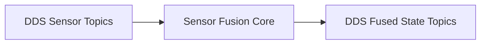

# dds-fusion-core

## Purpose
This repository contains the **embedded real-time brain** of the system.

It performs sensor fusion, state estimation, and health monitoring using DDS as the primary middleware.

## Responsibilities
- DDS publishers/subscribers
- Sensor fusion algorithms
- Time synchronization & QoS enforcement
- System state estimation

## What happens here
1. DDS receives sensor data
2. Fusion algorithms compute system state
3. Fused state is published via DDS
4. Health & status topics are updated

## Architecture

## Notes
- Must remain cloud-agnostic
- Designed to run on embedded Linux
- Determinism and timing are critical

