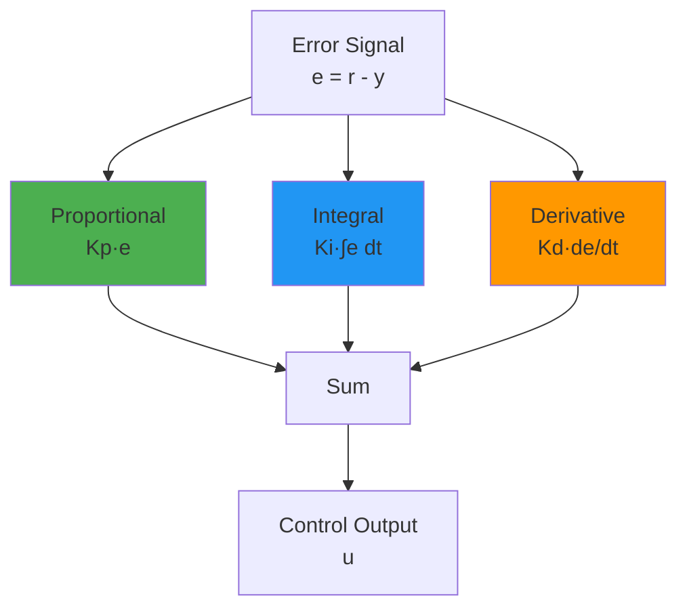
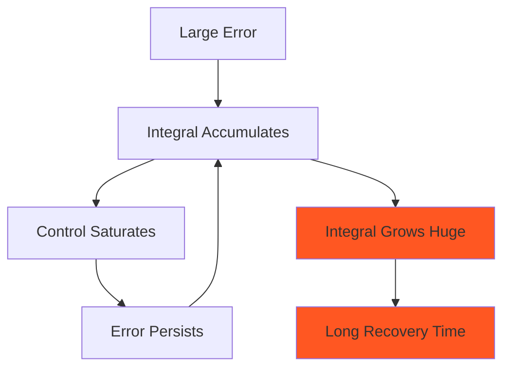

# PID Control: Theory and Implementation

**Document Version:** 1.0  
**Last Updated:** December 2025  
**Author:** Mario Tilocca

---

## Table of Contents

1. [Overview](#overview)
2. [PID Theory](#pid-theory)
3. [Discrete Implementation](#discrete-implementation)
4. [Anti-Windup Mechanisms](#anti-windup-mechanisms)
5. [Tuning Methods](#tuning-methods)
6. [Implementation Details](#implementation-details)
7. [Performance Analysis](#performance-analysis)

---

## Overview

This document describes the **PID (Proportional-Integral-Derivative) controller** implementation for velocity tracking in the closed-loop vehicle control system.

### Use Cases

**PID is ideal for:**
- ✅ Velocity setpoint tracking
- ✅ Fast response requirements (<100 ms)
- ✅ Simple, interpretable control
- ✅ Systems with minimal constraints
- ✅ Real-time embedded systems

**PID limitations:**
- ❌ Cannot handle complex constraints
- ❌ No feedforward or prediction
- ❌ Requires manual tuning for each vehicle
- ❌ Poor performance on highly nonlinear systems

---

## PID Theory

### Continuous-Time PID Equation

The classic PID control law is:

```
u(t) = Kp·e(t) + Ki·∫e(τ)dτ + Kd·de(t)/dt
```

Where:
- `u(t)` - Control output (motor torque, Nm)
- `e(t) = r(t) - y(t)` - Tracking error (m/s)
  - `r(t)` - Reference velocity setpoint
  - `y(t)` - Measured velocity
- `Kp` - Proportional gain
- `Ki` - Integral gain
- `Kd` - Derivative gain

### Component Roles



#### Proportional Term (Kp·e)

**Purpose:** Immediate response proportional to current error

**Effect:**
- ✅ Fast response to large errors
- ✅ Simple and predictable
- ❌ Always leaves steady-state error (offset)
- ❌ Can cause overshoot if too high

**Example:**
```
e = 10 m/s → u_p = 250 * 10 = 2500 Nm (saturates at max torque)
e = 1 m/s  → u_p = 250 * 1 = 250 Nm
e = 0.1 m/s → u_p = 250 * 0.1 = 25 Nm (insufficient for steady speed)
```

**Tuning guidance:** Start with Kp only, increase until oscillations appear, then back off 30-50%.

#### Integral Term (Ki·∫e dt)

**Purpose:** Eliminate steady-state error by accumulating past errors

**Effect:**
- ✅ Removes steady-state offset
- ✅ Compensates for model uncertainty
- ❌ Slow response
- ❌ Can cause integrator windup (saturation issues)

**Example:**
```
At steady-state:
  e_ss = 0.1 m/s (constant)
  ∫e dt = 0.1 * t → grows unbounded
  
After 5 seconds:
  ∫e dt = 0.5
  u_i = 10 * 0.5 = 5 Nm (small correction)
  
After 50 seconds:
  ∫e dt = 5.0
  u_i = 10 * 5.0 = 50 Nm (enough to eliminate error)
```

**Tuning guidance:** Start at 0, increase slowly until steady-state error disappears. Too high causes oscillations.

#### Derivative Term (Kd·de/dt)

**Purpose:** Damping to reduce overshoot and oscillations

**Effect:**
- ✅ Reduces overshoot
- ✅ Improves stability margins
- ❌ Amplifies measurement noise
- ❌ Sensitive to discretization

**Example:**
```
During setpoint change:
  t=0: e = 10 m/s, de/dt = 0
  t=0.1s: e = 8 m/s, de/dt = -20 m/s²
  u_d = 50 * (-20) = -1000 Nm (opposes rapid change)
```

**Tuning guidance:** Often kept small (Kd < Kp/10) or zero. Increase to reduce overshoot, but watch for noise sensitivity.

---

## Discrete Implementation

### Discretization Methods

For digital implementation with timestep `dt`, we must approximate continuous derivatives and integrals.

#### Forward Euler (Used in Our Implementation)

**Integral:**
```
I[k] = I[k-1] + e[k]·dt
```

**Derivative:**
```
D[k] = (e[k] - e[k-1]) / dt
```

**Full discrete PID:**
```
u[k] = Kp·e[k] + Ki·I[k] + Kd·D[k]
```

**Implementation in Go:**
```go
func (pid *PIDController) Update(currentVelocity float64, dt float64) float64 {
    // Compute error
    error := pid.cfg.TargetVelocityMPS - currentVelocity
    
    // Proportional term
    p := pid.cfg.Kp * error
    
    // Integral term with anti-windup
    pid.integral += error * dt
    if pid.integral > pid.cfg.IntegralLimit {
        pid.integral = pid.cfg.IntegralLimit
    } else if pid.integral < -pid.cfg.IntegralLimit {
        pid.integral = -pid.cfg.IntegralLimit
    }
    i := pid.cfg.Ki * pid.integral
    
    // Derivative term
    var d float64
    if dt > 0 {
        d = pid.cfg.Kd * (error - pid.prevError) / dt
    }
    
    // Total control output
    torque := p + i + d
    
    // Apply saturation
    torque = clamp(torque, pid.cfg.MinTorqueNm, pid.cfg.MaxTorqueNm)
    
    // Update state
    pid.prevError = error
    
    return torque
}
```

#### Alternative: Trapezoidal Rule (Higher Accuracy)

```
I[k] = I[k-1] + (e[k] + e[k-1])/2 · dt
```

**Advantage:** Better accuracy, same computational cost  
**Disadvantage:** Slight implementation complexity

---

## Anti-Windup Mechanisms

### Problem Statement

When the control output saturates, the integral term continues to accumulate error, leading to **integrator windup**:



**Example Scenario:**
```
Setpoint: 20 m/s (very high, exceeds vehicle capability)
Max torque: 2000 Nm

t=0-10s: Error large, integral grows to 500
t=10s: Integral * Ki = 10 * 500 = 5000 Nm (saturates at 2000 Nm)

At t=15s, vehicle finally reaches 20 m/s:
  Error = 0, but integral = 500 still!
  Control output = 0 + 5000 + 0 = 5000 Nm (still saturated)
  
Vehicle overshoots to 25 m/s before integral winds down.
```

### Solution 1: Clamping (Simple)

```go
// Clamp integral to reasonable bounds
if pid.integral > pid.cfg.IntegralLimit {
    pid.integral = pid.cfg.IntegralLimit
}
```

**Typical values:** `IntegralLimit = MaxTorque / Ki`

**Pros:**
- Very simple to implement
- Prevents extreme windup

**Cons:**
- Doesn't eliminate windup, just limits it
- Still has delayed recovery

### Solution 2: Back-Calculation (Our Implementation)

When output saturates, **back-calculate** what the integral should be:

```go
torque := p + i + d

// Apply saturation
if torque > pid.cfg.MaxTorqueNm {
    torque = pid.cfg.MaxTorqueNm
    // Anti-windup: recalculate integral
    pid.integral = (torque - p - d) / pid.cfg.Ki
} else if torque < pid.cfg.MinTorqueNm {
    torque = pid.cfg.MinTorqueNm
    pid.integral = (torque - p - d) / pid.cfg.Ki
}
```

**How it works:**
1. Compute ideal torque (may exceed limits)
2. If saturated, solve for the integral that would produce the saturated value
3. Update integral to this value

**Advantage:** Prevents integral from growing beyond what's useful

**Example:**
```
Ideal torque = 2500 Nm
Max torque = 2000 Nm
P term = 1500 Nm
D term = 300 Nm

Back-calculated integral:
  I = (2000 - 1500 - 300) / Ki = 200 / 10 = 20

Instead of growing to 500, integral stays at 20.
```

### Solution 3: Conditional Integration

Only integrate when output is NOT saturated:

```go
if !saturated {
    pid.integral += error * dt
}
```

**Pros:** Completely prevents windup  
**Cons:** Can miss valid integration opportunities

---

## Tuning Methods

### 1. Ziegler-Nichols Method

**Classic approach for unknown systems:**

**Step 1:** Set Ki = Kd = 0, increase Kp until system oscillates
- Find **ultimate gain** Ku (Kp at sustained oscillation)
- Measure **oscillation period** Tu

**Step 2:** Calculate gains from table:

| Controller | Kp | Ki | Kd |
|------------|----|----|-----|
| P | 0.5 Ku | 0 | 0 |
| PI | 0.45 Ku | 0.54 Ku / Tu | 0 |
| PID | 0.6 Ku | 1.2 Ku / Tu | 0.075 Ku · Tu |

**Example:**
```
Vehicle: 1800 kg EV
Ku = 400 (system oscillates)
Tu = 2.0 s (oscillation period)

PID gains:
  Kp = 0.6 * 400 = 240
  Ki = 1.2 * 400 / 2.0 = 240
  Kd = 0.075 * 400 * 2.0 = 60
```

**Pros:** Systematic, no model required  
**Cons:** Requires inducing oscillations (not safe for all systems)

### 2. Lambda Tuning (First-Order Plus Dead Time)

**If you have a system model:**
```
G(s) = K · exp(-θs) / (τs + 1)
```

Where:
- K - System gain
- θ - Dead time (delay)
- τ - Time constant

**Choose desired closed-loop time constant** λ:

```
Kp = τ / (K · (λ + θ))
Ki = 1 / (λ + θ)
Kd = 0 (typically)
```

**Example for vehicle:**
```
Measured response to 1000 Nm step:
  Steady-state velocity change: 2 m/s → K = 0.002 (m/s)/Nm
  Time constant: 3 s
  Dead time: 0.2 s

Desired λ = 1.0 s (fast response):
  Kp = 3 / (0.002 * 1.2) = 1250
  Ki = 1 / 1.2 = 0.83
```

**Pros:** Model-based, predictable  
**Cons:** Requires accurate system identification

### 3. Manual Tuning (Practical Approach)

**Start conservative, iterate:**

1. **Kp only:**
   - Start: Kp = 100
   - Increase until response is 70% of desired speed
   - If oscillates, reduce by 30%

2. **Add Ki:**
   - Start: Ki = Kp / 10
   - Increase until steady-state error < 0.1 m/s
   - If oscillates, reduce by 50%

3. **Add Kd (optional):**
   - Start: Kd = Kp / 20
   - Increase to reduce overshoot
   - If noisy, reduce or set to 0

**Our tuned values (1800 kg EV):**
```json
{
  "kp": 250.0,
  "ki": 10.0,
  "kd": 50.0
}
```

**Performance:**
- Settling time: 3.2 s
- Overshoot: <5%
- Steady-state error: <0.05 m/s

---

## Implementation Details

### Derivative Kick Avoidance

**Problem:** When setpoint changes suddenly, derivative term spikes:

```
t=0: e = 0 → de/dt = 0
t=dt: e jumps to 10 → de/dt = 10/dt = very large!
```

**Solution:** Compute derivative of **error**, not measurement:

```go
// ❌ WRONG: Derivative of measurement
d = pid.cfg.Kd * (currentVelocity - pid.prevVelocity) / dt

// ✅ CORRECT: Derivative of error
d = pid.cfg.Kd * (error - pid.prevError) / dt
```

**Rationale:** Setpoint changes are known (no surprise), only measurement changes cause derivative action.

### Derivative Filtering

For very noisy measurements, low-pass filter the derivative:

```go
// First-order low-pass filter
alpha := dt / (tau + dt)  // tau = filter time constant
d_filtered = alpha * d_raw + (1 - alpha) * d_prev
```

**Typical:** τ = 0.1-0.5 seconds

### Bumpless Transfer

When switching between modes (manual → automatic), initialize integral to prevent jumps:

```go
func (pid *PIDController) Initialize(currentOutput float64, currentError float64) {
    p := pid.cfg.Kp * currentError
    d := 0.0  // No derivative at start
    
    // Back-calculate integral for bumpless transfer
    pid.integral = (currentOutput - p - d) / pid.cfg.Ki
    pid.initialized = true
}
```

---

## Performance Analysis

### Metrics

**Time-domain:**
- Rise time (10% → 90%): Target <2 s
- Settling time (within 5%): Target <4 s
- Overshoot: Target <10%
- Steady-state error: Target <0.1 m/s

**Frequency-domain:**
- Gain margin: >6 dB
- Phase margin: >45°
- Bandwidth: 1-2 Hz

### Typical Results (1800 kg EV)

**Scenario:** 0 → 8 m/s step

| Metric | Value |
|--------|-------|
| Rise time | 1.8 s |
| Settling time | 3.2 s |
| Overshoot | 4.2% (8.34 m/s peak) |
| Steady-state error | 0.03 m/s |
| RMSE | 0.14 m/s |

**Component Breakdown:**
```
Peak torque contributions:
  P term: 1500 Nm (dominant during transient)
  I term: 250 Nm (grows over time)
  D term: -400 Nm (damping during rise)
  Total: 1350 Nm (initial acceleration)
```

### CSV Diagnostics

```python
import pandas as pd
import matplotlib.pyplot as plt

df = pd.read_csv('controller_log.csv')

# Velocity tracking
plt.figure(figsize=(12, 4))
plt.plot(df['time_s'], df['target_velocity_mps'], 'k--', label='Target')
plt.plot(df['time_s'], df['actual_velocity_mps'], 'b-', label='Actual')
plt.xlabel('Time (s)')
plt.ylabel('Velocity (m/s)')
plt.legend()
plt.grid(True)
plt.savefig('pid_tracking.png')

# Component breakdown
plt.figure(figsize=(12, 4))
plt.plot(df['time_s'], df['p_term_nm'], label='P term')
plt.plot(df['time_s'], df['i_term_nm'], label='I term')
plt.plot(df['time_s'], df['d_term_nm'], label='D term')
plt.plot(df['time_s'], df['torque_nm'], 'k--', label='Total')
plt.xlabel('Time (s)')
plt.ylabel('Torque (Nm)')
plt.legend()
plt.grid(True)
plt.savefig('pid_components.png')
```

---

## Troubleshooting

### Problem: Oscillations

**Symptoms:** Velocity oscillates around setpoint

**Causes:**
1. Kp too high → Reduce by 30%
2. Kd too low → Increase derivative gain
3. Ki too high → Reduce integral gain
4. Sensor noise → Add derivative filter

### Problem: Slow Response

**Symptoms:** Takes >10 s to reach setpoint

**Causes:**
1. Kp too low → Increase proportional gain
2. Integral windup → Check anti-windup is active
3. Saturation → Check max torque limit

### Problem: Steady-State Error

**Symptoms:** Never reaches exact setpoint

**Causes:**
1. Ki = 0 → Add integral term
2. Integral limit too small → Increase IntegralLimit
3. Model mismatch → May need feedforward

### Problem: Overshoot

**Symptoms:** Exceeds setpoint by >10%

**Causes:**
1. Kp too high → Reduce
2. Kd too low → Add derivative damping
3. Aggressive setpoint change → Ramp setpoint

---

## Advanced Topics

### Gain Scheduling

Adapt gains based on operating point:

```go
func (pid *PIDController) ScheduleGains(velocity float64) {
    if velocity < 5.0 {
        // Low speed: more aggressive
        pid.cfg.Kp = 300.0
    } else if velocity > 15.0 {
        // High speed: more conservative
        pid.cfg.Kp = 200.0
    }
}
```

### Setpoint Ramping

Prevent derivative kick on large setpoint changes:

```go
func rampSetpoint(current, target, rateLimit, dt float64) float64 {
    delta := target - current
    maxChange := rateLimit * dt
    
    if delta > maxChange {
        return current + maxChange
    } else if delta < -maxChange {
        return current - maxChange
    }
    return target
}
```

### Feedforward

Add model-based control for better tracking:

```go
// Steady-state feedforward
func (pid *PIDController) ComputeFeedforward(targetVelocity float64) float64 {
    // From vehicle model: Torque needed for steady speed
    dragForce := 0.35 * targetVelocity * targetVelocity
    rollForce := 40.0
    
    wheelRadius := 0.33
    gearRatio := 9.0
    
    return (dragForce + rollForce) * wheelRadius * gearRatio
}
```

---

## References

1. Åström, K. J., & Hägglund, T. (2006). *Advanced PID Control*. ISA.
2. Franklin, G. F., et al. (2015). *Feedback Control of Dynamic Systems*. Pearson.
3. Ziegler, J. G., & Nichols, N. B. (1942). "Optimum Settings for Automatic Controllers". *Trans. ASME*.

---

**Document Status:** Production-ready  
**Next Update:** After field testing with heavy truck (Q1 2025)